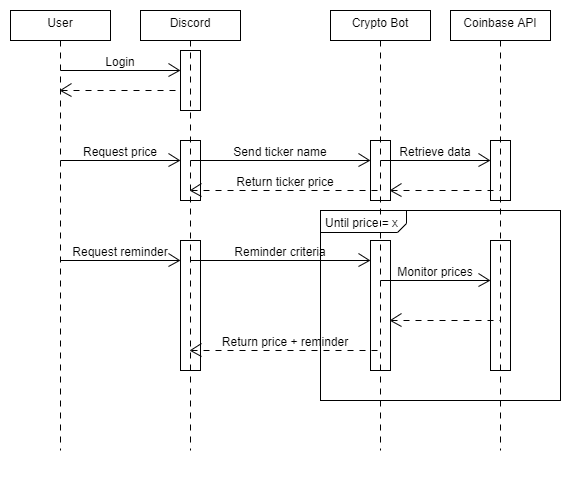

**DESIGN MILESTONE 1**

**Problem Statement:**

Recently, many novice investors have joined the stock/cryptocurrency markets. This is partly due to the massive amount of media coverage that certain stocks/cryptocurrencies and exchanges have been getting (think GME and Robinhood for example), and also because of the rether recent inflation of cryptocurrency prices (like Bitcoin). Many of these new - and often young - investors have little to no knowledge of how investing works, and they base their investing decisions based on social media "hype" and trading YouTube channels' advice. These type of investors can be categorized as day traders, and not long-term investors. Often, the crypto/stock price or the shape of the stock's price graph is the deciding factor for when they want to sell or buy new shares. Few of these new investors pay attention to balance sheets and other financial reports, and even fewer understand how cryptocurrencies work. 

This brings us to the problem at hand - the new age investors need a quick and easy way to access stock/cryptocurrency prices while participating in investing conversations with their friends or other fellow investors. This is a relevant problem because many of these users want on-demand answers and are accustomed to user-friendly and visual exchanges, like Robinhood and Coinbase. Usually, novice investors only pay attention to the ticker price, so there needs to be a way to deliver that information without having to open new windows or checking a phone app while having an online discussion about stocks. 

**Bot Description:**

We are going to focus on cryptocurrencies and create a Crypto Bot. This bot will live in a Discord server, and it will be used to quickly get current prices of cryptocurrencies based on the ticker or name. The Crypto Bot will monitor conversations for any mentions of cryptocurrencies and respond with current market data of a mentioned cryptocurrency. Also, members of the given server will be able to request this price data from the bot using a certain command or key words. Possibly, we may also choose to add notifying features to the bot, so that a user could ask the Crypto Bot to send out a message when the price of a certain crypto reaches (or drops to) a pre-set value. This would require some memory/storage.

The Crypto Bot will be a great solution to the problem because it will live in Discord servers, where a lot of new young investors seek investing advice or just chat about cryptocurrencies. This bot will allow them to check stock prices without interrupting their conversation to search for it or to check their phone app (which may also require login and authentication of the user).

*Tagline: "Crypto Bot - a must-have for newbie crypto investors!"*

**Use Cases:**

1. *Use case: check ticker prices*

i. Preconditions

None

ii. Main flow

User requests the current price of a cryptocurrency. The bot will display the current price.

iii. Subflows

* The user initializes the bot with a keyword and then types in either the ticker name or cryptocyrrency full name.
* The bot responds by replying to the user with the current price of the crypto and with the timestamp of when that data was gathered.

iv. Alternative flows

The requested ticker either doesn't exist or the user misspells the name. In this case, the bot cannot find the indicated crypto data and asks the user to check the spelling (or sends out an error message).

2. *Use case: set price reminder*

i. Preconditions

The user that requests the reminder does not leave the server after the request is made.

ii. Main flow

User asks the bot to remind him/her when the price of a cryptocurrency reaches a certain level. The bot records this request and continuously monitors the prices in the background. If or when the price reaches that level, the bot send a message to the Discord channel. The notification task is complete.

iii. Subflows 

* The user initializes this function of the Crypto Bot with a key word and ticker name.
* The bot asks what is the target price.
* The user responds with a dollar value.
* The bot stores this request in a database and monitors the indicated crypto price. When the price reaches that level, the bot tags the user in a message with the crypto price and time stamp. The bot stops monitoring this crypto in the background.

iv. Alternate flows

If too much time has passed, the bot may ask the user who requested the reminder if he/she still wants the bot to monitor the indicated cryptocurrency. Alternatively, the user can also tell the bot that he/she no longer needs the reminder.

**Design Sketches:**

Sequence Flow Diagram:

Storyboard:

**Architecture Design:**

(Create a diagram that illustrates the components of your bot, the platform it is embedded in, third party services it may use, data storage it may require, etc.)
(Describe the architecture components in text.)
(This section should be several diagrams + paragraphs of text. Generic architectures that do not properly reflect a solution will receive low scores.)