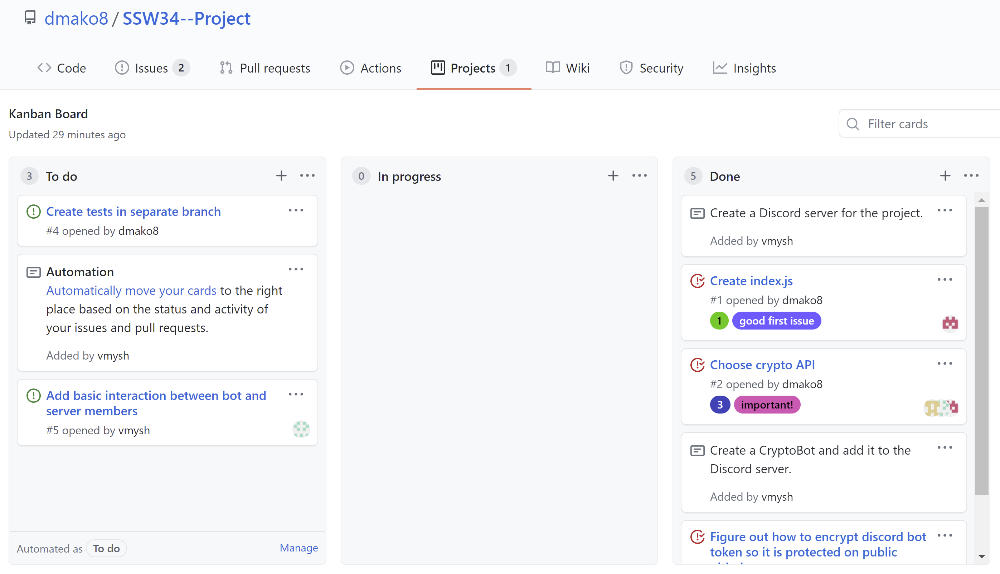
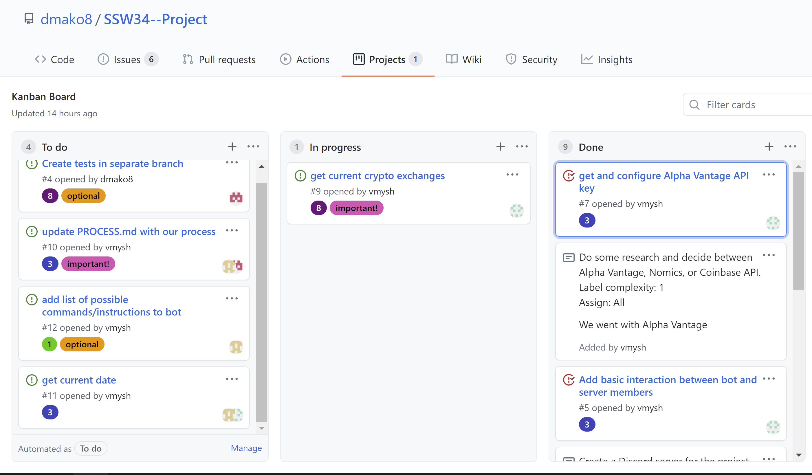
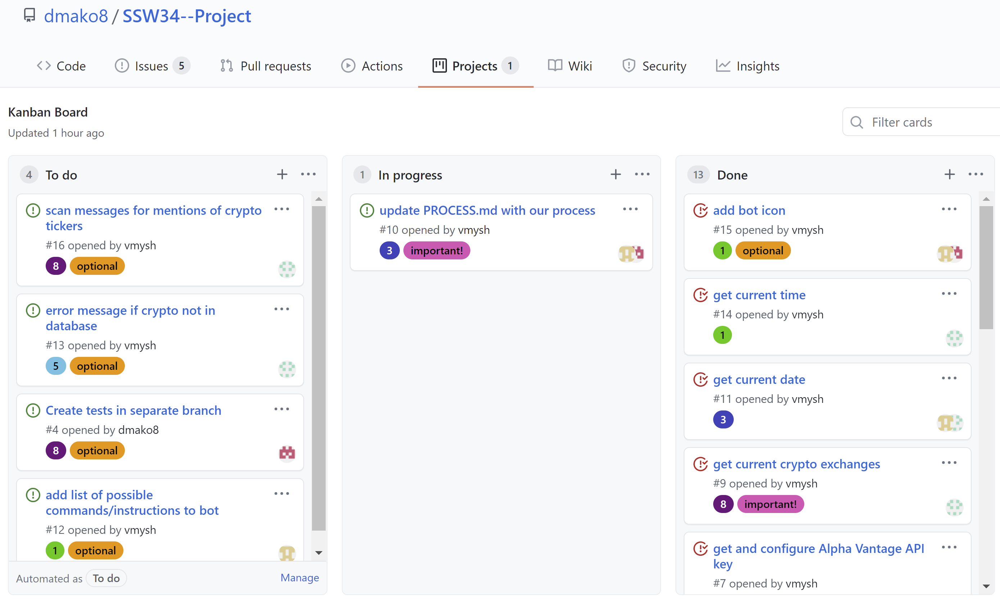

**PROCESS MILESTONE**

**Fitst Iteration:**

Our first iteration was very drawn out and much longer than the second. For this iteration, we focused on creating and connecting the bot to Discord and on doing research into which API keys we should use for this project. We also brainstormed some user stories like so...

User Stories:

1. Use Discord interface to link crypto bot to a Discord server. (1 Complexity)
2. Enter discord bot command and desired crypto ticker to display ticker and price. (1 Complexity)
~~3. Enter discord bot command, desired crypto ticker and target price to create alert should the crypto reach that price. (3 Complexity)~~
~~4. Enter discord bot command to display biggest movers in the last day, week, month, year. (5 Complexity)~~

In the end, we ended up implementing issues and a Kanban board on GitHub to create stories/tasks, to assign complexity points to these tasks (1,3,5,8), and to assign developers to each task. Issues and notes started off in the "To do" column, then were moved to the "In progress" column. When an issue was closed, it was moved to the "Done" column. We also decided to add additional labels to each task to indicate which ones were most important to focus on at the moment, and which ones were optional. Here is what our Kanban board looked like at the end of the first iteration:

You can also see this Kanban board in Projects of this GitHub repository.

We did not hold any scrum meetings or take any meeting notes doring both iterations. Instead, all communication was done through GroupMe or on our Discord server's voice channel.

Reflecting on our progress after the first iteration, it can be said that time could have been spent more productively, instead of leaving all important tasks until the second iteration.

**Second Iteration:**

This iteration was much shorter than the first, and more tasks were completed than in the first iteration. We decided to focus on our main use-case of retrieving current cryptocurrency prices when requested by a user. Here is what our story/task assignments and labels looked like at the beginning of this iteration:

During this iteration we also did not take any scrum meeting notes. Here is what our Kanban board looked like at the end of the second iteration:

As you can see, not all issues are closed. These issues were marked as "optional" because they were not necessary to implement the use-case under our team's time constraints. These tasks were still left on the board in case the team decides to do a third iteration to continue adding features and improving the CryptoBot.

Overall, there are some important lessons to be learned from these two iterations and the process that we used. First, better organization is needed to not leave everything until the last minute. Also, it would be helpful to automate the Kanban board next time so that issues automatically get moved to the "Done" column. Finally, it would have been beneficial if the team had discussed and agreed upon meeting times and stuck to those dates to be more productive, istead of having unplanned meetings.

**Here is the demo video:** [Grader Demo](https://www.youtube.com/watch?v=9Jw5FSSxyYY)