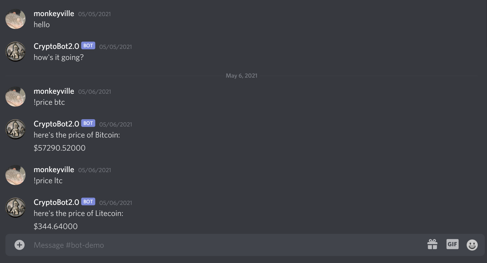
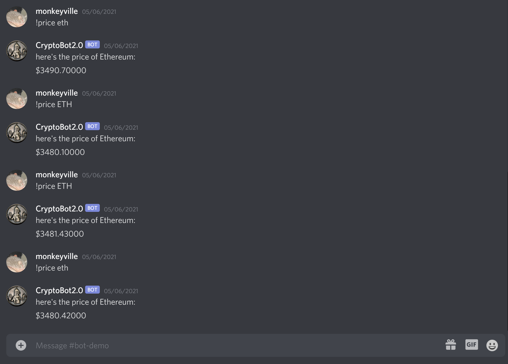

# Report

## Project Presentation

Here is the link to our project presentation: [video](https://www.youtube.com/watch?v=9Jw5FSSxyYY) 

## Problem

 Novice investors need a quick and easy way to access stock/cryptocurrency prices while participating in investing conversations with their friends or other fellow investors. This is a relevant problem because many of these users want on-demand answers and are accustomed to user-friendly and visual exchanges, like Robinhood and Coinbase. Usually, novice investors only pay attention to the ticker price, so there needs to be a way to deliver that information without having to open new windows or checking a phone app while having an online discussion about stocks.

## Primary Features and Screenshots

The primary feature of CryptoBot is to quickly deliver the most recent trading price of cryptocurrencies. We chose to make a Discord bot because this is a platform where many novice investors hold conversations about their portfolios and/or strategies. Users can quickly get the current quote for a cryptocurrency by using the '!price' command followed by the crypto ticker symbol. We used the Alpha Vantage API, which supports live data for 564 cryptocurrencies. Here is a screenshot showing how CryptoBot responds with the current price of Bitcoin and Litecoin:

CryptoBot also responds with the full name of the requested cryptocurrency, so all other members of the Discord channel can know wich cryptocurrency is being discussed if they are not familiar with the ticker symbol. In addition, the API that we used supports live crypto price collection up to 1-minute intervals. This is an important feature, since cryptocurrencies are generally volatile, and many novice crypto investors base their decisions about buying/selling on whether their watched cryptocurrency reaches a certain price point. Here is a screenshot showing CryptoBot responding with the current price of Etherium in 1-minute intervals:

## Reflection on the Development Process and Project

Overall, this project provided a great opportunity to apply all concepts that were learned in class - from workflow organization practices to working with REST APIs. The different project milestones were meant to help teams apply these concepts to their projects. The Design Milestone was helpful for brainstorming different project ideas and deciding on one problem to focus on. The emphasis on problem-solution development and the drafting of different possible use-case scenarios helped to not stray far from the original bot project idea. The Process Milestone taught us how to implement a Kanban board in our project in order to divide the work into tasks/issues and assign developers to each item. We also got to practice using Git and GitHub as a team (although much more practice is needed). 

During the development process we had to learn how to learn. This included reading Discord documentation and watching different tutorial videos to figure out how to create a Discord bot and reading the Alpha Vantage documentation to implement the API to solve the problem of our project (some things none of us have done before). Learning new skills will be an essencial part of future projects, which is something we got to practice with this bot project.

## Limitations and Future Work

One of the limitations for our team was getting organized enough to finish the project in multiple small iterations over a longer period of time, instead of having a couple of large iterations over a short period of time. It would have helped if there was dedicated class time throughout the week just to work on the project as a group. This would have helped with accountability. Also, making a Kanban board in the very beginning of the project (possibly during the Design Milestone) and assigning developers to each task would hahve possibly helped to divide the workload better, since many of the issues were created during the development process. 

Another limitation we faced was due to not using GitHub to its full potential for teamwork. Originally, we planned to use different development branches, but we ended up only using the Master/Main branch because we did not establish who would be in charge of checking and approving merge requests. Also, we did not implement the automatization of issues in the Kanban board. This would be a useful feature to save time in future projects.

There are many more feaures that could be added to CryptoBot in the future. This is a great project to return to to get more practice using the Alpha Vantage API and, possibly, databases. For example, during the Design Milestone one of the possible use-case scenarios was to allow users to request reminder alerts for when a watched crypto reaches a certain price point. This would require the use of  a database to store these requests until (if ever) they are fulfilled. Furthermore, the API we used supports other interesting and useful crypto metrics, like charts. Technically, CryptoBot could also be used for monitoring the stock market...but then it would not be a "Crypto" Bot.