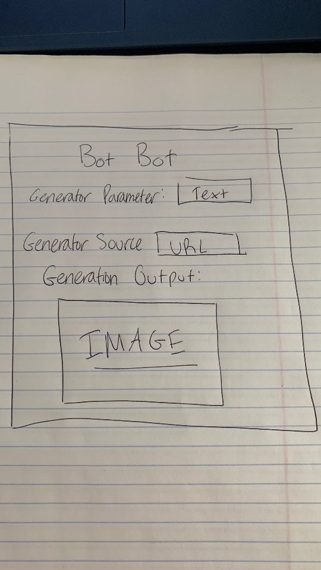

1.Read through seed ideas (Links to an external site.). Select 1-2 your group might want to work on.

We want to work on a Discord Music Bot or Pricing Bot

2.Describe the problems. (10 minutes).

a.What is the core problem each bot is trying to solve?

Discord Bot solves the problem of friends in a Discord chat wanting to listen to the same song together.

b.Why is it a problem worth solving?

It is worth solving because of how many people use Discord while listening to music.

3.Describe possible designs: (10 minutes).

a.What is the core product idea?

A bot that accepts a requested YouTube or Spotify song (link) from a user and plays it for everyone in the server channel.

b.What are patterns that might be useful?

Bot design patterns that may be useful to consider: chatbot, space reactors, responders. 

c.Design sketches: Use wireframes, storyboards, and flow maps to describe your problem.

**UPDATE:** We pivoted from the original idea. We still want to work on a Discord bot, but we want to make it a cryptocurrency bot. The DESIGN.md outlines the new idea.
